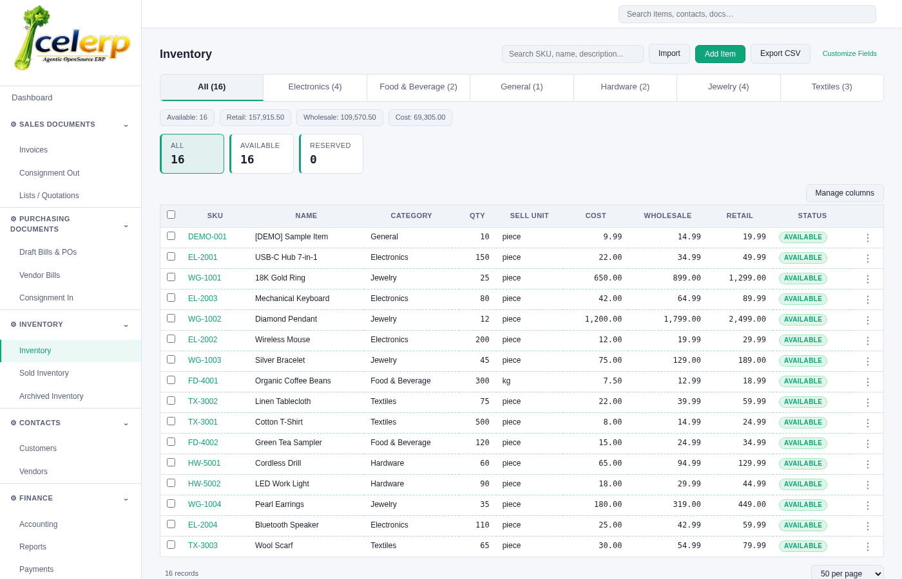

# Celerp

**Open-source ERP. Runs on your machine. You own everything.**

Inventory, invoicing, purchasing, manufacturing, accounting, and CRM - in one app, on your computer. No subscription. No cloud required.

[](https://github.com/celerp/celerp/actions)
[](LICENSE)



---

## Install

| Platform | Link |
|----------|------|
| Windows (.exe) | [Latest release](https://github.com/celerp/celerp/releases/latest) |
| Linux (.AppImage) | [Latest release](https://github.com/celerp/celerp/releases/latest) |
| macOS (.dmg) | Coming soon |

**Double-click. No account. No credit card. No server.**

Or install via pip:

```bash
pip install celerp
celerp init
celerp start
```

Open **http://localhost:8080**. Done.

---

## What's inside

- Track inventory across locations, scan barcodes, print labels
- Send invoices, purchase orders, quotations, credit notes
- Double-entry accounting with chart of accounts, P&L, balance sheet
- Connect Shopify, WooCommerce, QuickBooks, Xero
- Manufacturing - BOMs, production orders, merge/split/transform
- CRM - contacts, pipeline, memos, activity feed
- Recurring subscriptions with automatic invoicing
- CSV import/export everything - idempotent, audited, column-mapped
- Multi-company from one install
- Role-based permissions - five access levels (viewer, operator, manager, admin, owner) for controlled employee access
- Works offline, no internet required

---

## How it works

Celerp runs entirely on your machine. Your data never leaves your computer.

- **No setup** - the desktop app bundles Postgres, runs migrations on launch, opens in your browser
- **No lock-in** - your data stays in a standard Postgres database you control
- **Teams** - run as a local server, teammates connect over the LAN

---

## Modules

Every business domain is a self-contained module. The full set ships with the download:

| Module | What it does |
|--------|-------------|
| `celerp-inventory` | Items, stock levels, locations, barcode scanning, valuation |
| `celerp-contacts` | Contacts, addresses, tags, notes, file attachments |
| `celerp-docs` | Invoices, POs, quotations, credit notes, receipts |
| `celerp-accounting` | Chart of accounts, journal entries, P&L, balance sheet |
| `celerp-reports` | AR/AP aging, sales, purchases, inventory valuation |
| `celerp-subscriptions` | Recurring billing, auto-invoice generation |
| `celerp-manufacturing` | BOMs, production orders, merge/split/transform |
| `celerp-labels` | Label printing, barcode generation |
| `celerp-verticals` | Industry presets - configure for your business type on first run |

The onboarding wizard lets you pick your industry. Modules can be toggled any time at **Settings > Modules**.

---

## Architecture

- **Event-sourced** - every change is an immutable ledger entry, projections materialize queryable state
- **Modular** - each domain is a plugin with its own models, routes, and projections
- **Python/FastAPI** backend, **FastHTML** UI, embedded **PostgreSQL**
- SQLite in-memory for tests - no external dependencies to run the test suite

---

## Development

```bash
git clone git@github.com:celerp/celerp.git
cd celerp
python3 -m venv .venv && source .venv/bin/activate
pip install -e ".[dev]"
sudo celerp init   # creates DB, runs migrations, starts servers
```

Open **http://localhost:8080**. Run tests with `pytest tests/`.

See [CONTRIBUTING.md](CONTRIBUTING.md) for environment variables, troubleshooting, and coding guidelines.

---

## Contributing

Issues and PRs welcome. The module system makes it straightforward to add new business domains without touching the kernel.

---

## License

[BSL-1.1](LICENSE). Free to use, free to modify, free to self-host. Commercial redistribution restricted for 4 years, after which the code converts to Apache 2.0.
