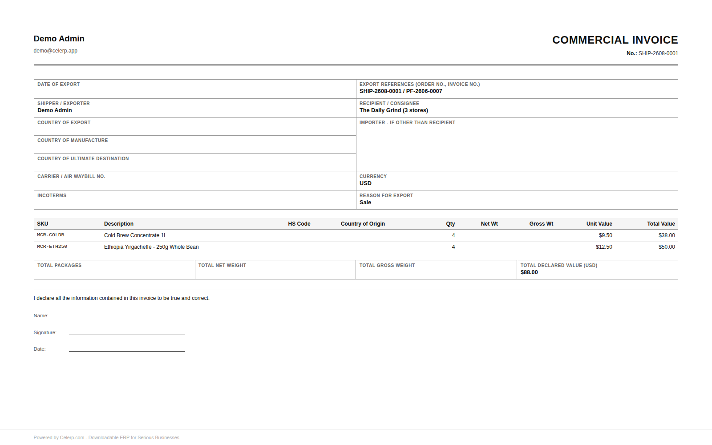
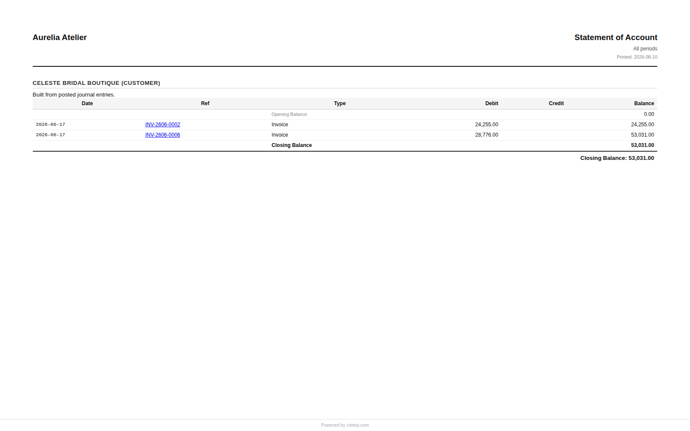
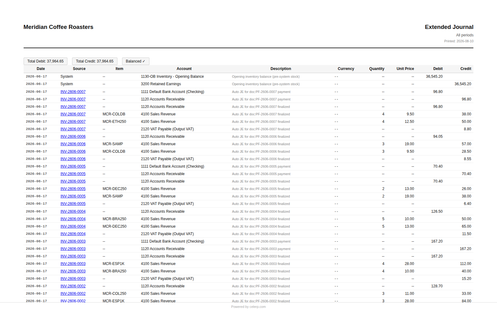
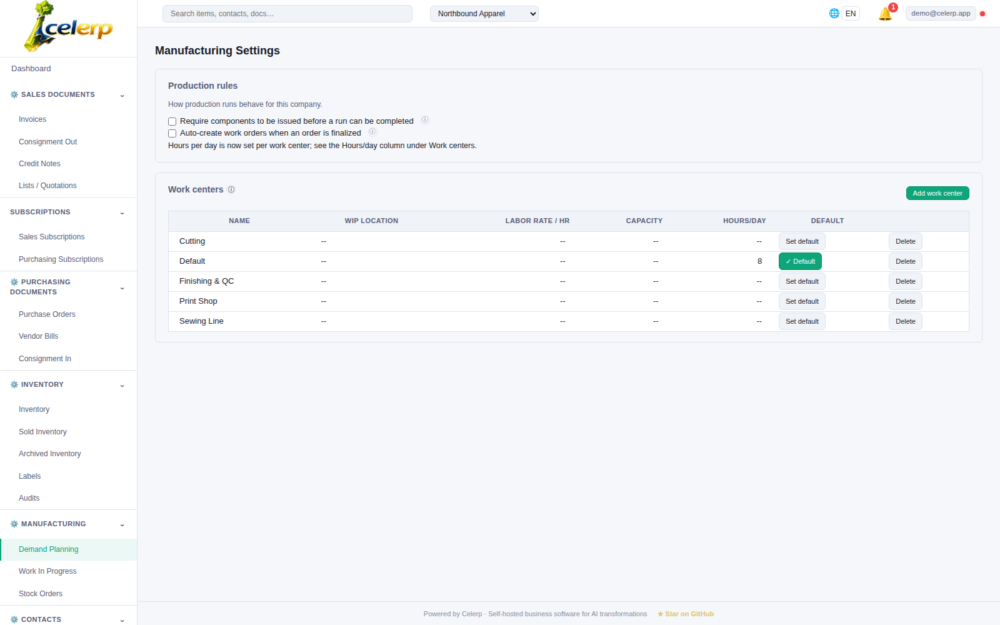
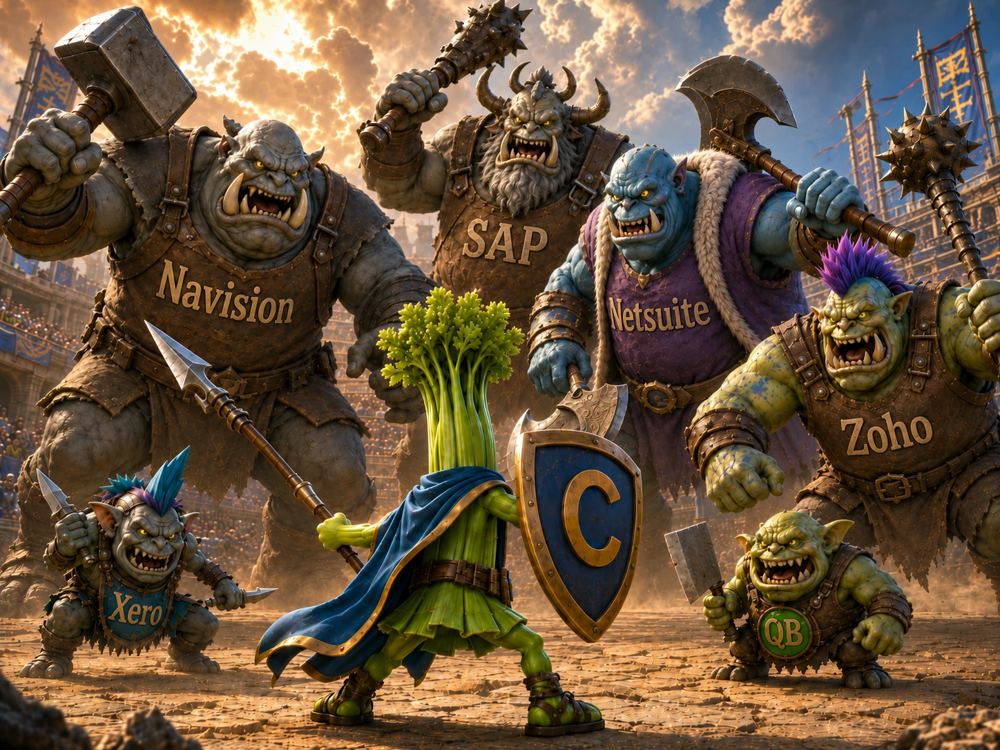

# Celerp - Press Kit

Celerp is free, source-available business management software - inventory, invoicing, purchasing,
manufacturing, double-entry accounting, and CRM in one app that runs on your own computer. No
subscription, no cloud required. Easy enough for solo entrepreneurs, deep enough for enterprises.

Website: https://www.celerp.com - Repository: https://github.com/celerp/celerp

## Quote from the founder

> "My vision for Celerp is that anyone with AI coding tools can describe what their business needs
> and get a module that imports right into the system."
>
> Noah Severs, Founder

## Screenshots

These images are the canonical source for the README, the website, and external listings. Read them
directly from the repo, or via the jsDelivr CDN:
`https://cdn.jsdelivr.net/gh/celerp/celerp@main/docs/press-kit/screenshots/<name>.png`

They are regenerated by the capture pipeline
(`serve.py -> seed.py -> capture.py -> capture_apidocs.py -> press_kit.py`); do not edit by hand.

<!-- PRESS_KIT:gallery start -->
### Manufacturing cost worksheet - bill of materials, labor, overhead, and rolled-up unit cost (hero)

### Double-entry trial balance that ties out to zero

### Balance sheet generated live from the event-sourced ledger

### General ledger with full account drill-down

### Multi-location inventory with barcode scanning and valuation

### Production planning - work orders by status, priority, and due date

### Built-in REST API for integrations

### Real-time dashboard - revenue trend, receivables aging, and inventory mix

### International shipping document - commercial invoice and customs pack

### Statement of account - customer receivables at a glance

### Extended journal - every posting with full detail

### Work centers - labor rates and capacity by station

<!-- PRESS_KIT:gallery end -->

## Industry-specific screenshots

Covering a specific business type? Each folder below holds the full set of screens captured for that
industry's demo company - pick the ones that fit your story. Open a folder to see its gallery, or read
the files via the CDN: `https://cdn.jsdelivr.net/gh/celerp/celerp@main/docs/press-kit/screenshots/<industry>/<name>.png`

<!-- PRESS_KIT:industry-list start -->
- **[Apparel & clothing](apparel/)** - Northbound Apparel: 17 screens
- **[Coffee roasting](coffee/)** - Meridian Coffee Roasters: 15 screens
- **[Cosmetics & skincare](cosmetics/)** - Lumera Skincare: 13 screens
- **[Jewelry](jewelry/)** - Aurelia Atelier: 15 screens
<!-- PRESS_KIT:industry-list end -->

## Artwork

Hand-illustrated brand graphics (not screenshots) - for blog posts, social, and launch coverage.
Read them via the CDN: `https://cdn.jsdelivr.net/gh/celerp/celerp@main/docs/press-kit/artwork/<name>.webp`

### Celerp vs. legacy ERPs

### Celerp vs. SaaS

Usage and copyright for this artwork are the same as the screenshots below.

## Usage & copyright

These screenshots depict the **Celerp application UI**, which is proprietary
(see `/legal/OFFICIAL-COMPONENTS.md`; the UI layer is *not* covered by the BSL core or MIT module licenses).

- Screenshots (c) 2026 Noah Severs. All rights reserved. Provided to document and promote Celerp;
  you may use them unmodified in articles, reviews, and listings about Celerp with attribution to
  Celerp. Do not alter the interface shown or imply endorsement.
- Product imagery embedded in the screenshots is CC0 / public domain (sourced via Openverse) and
  needs no attribution.
- Company and brand names shown (Lumera Skincare, Meridian Coffee Roasters, Aurelia Atelier,
  Northbound Apparel) are fictional demo data.
- The brand artwork (`artwork/`) is (c) 2026 Noah Severs, all rights reserved, and is provided on the
  same terms. Third-party product names shown in it (e.g. SAP, NetSuite, Zoho, Xero, Navision,
  QuickBooks) are trademarks of their respective owners; they appear as parody/commentary and do not
  imply affiliation or endorsement.

For use of the Celerp name and logo, see `/legal/TRADEMARK.md`.
