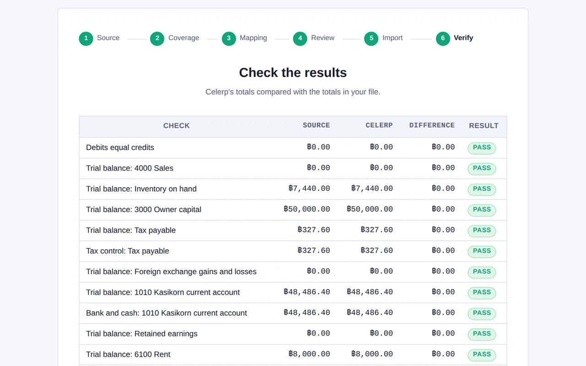
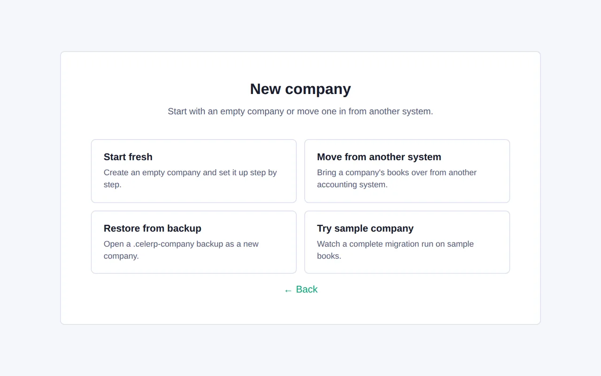
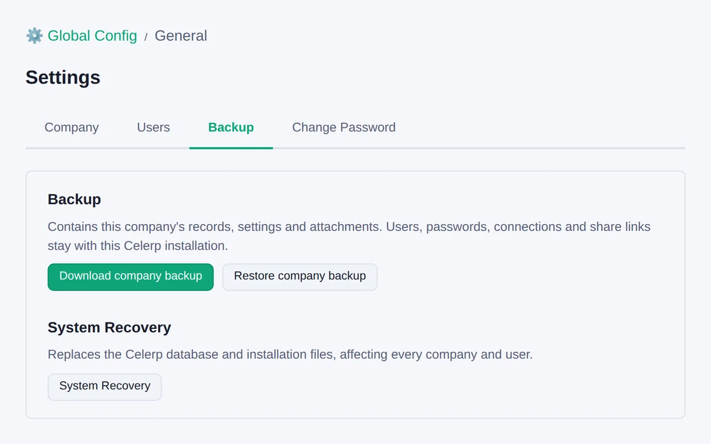

# Celerp - Accountants page screenshots

Screens shown on the Celerp accountants page, captured with fictional demo data. Part of the [Celerp press kit](../../README.md).

### Migration check: source, Celerp and the difference for each balance

### New company: start fresh, move a client in, or restore a backup

### Company backup download

## Usage & copyright

These screenshots depict the **Celerp application UI**, which is proprietary
(see `/legal/OFFICIAL-COMPONENTS.md`; the UI layer is *not* covered by the BSL core or MIT module licenses).

- Screenshots (c) 2026 Noah Severs. All rights reserved. Provided to document and promote Celerp;
  you may use them unmodified in articles, reviews, and listings about Celerp with attribution to
  Celerp. Do not alter the interface shown or imply endorsement.
- Company and customer names shown (Lanna Craft Supply and its customers and suppliers) are
  fictional demo data.

For use of the Celerp name and logo, see `/legal/TRADEMARK.md`.
