# Celerp - Apparel & clothing screenshots

Full set of Celerp screens captured for **Northbound Apparel** (fictional demo data). Part of the [Celerp press kit](../../README.md).

### Dashboard - revenue trend, receivables aging, and inventory mix

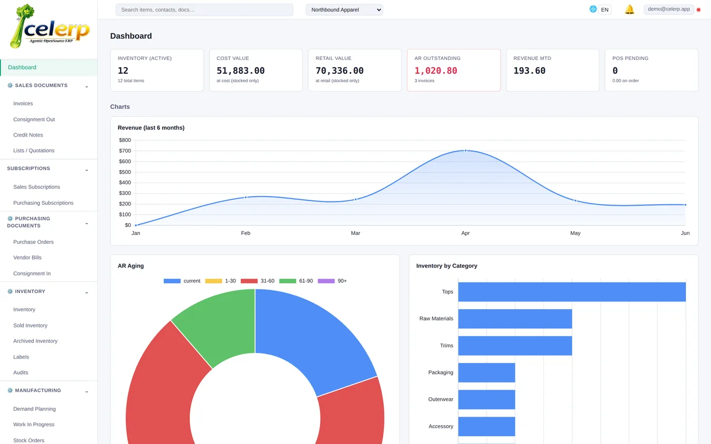

### Inventory - attributes, barcodes, and multi-location valuation

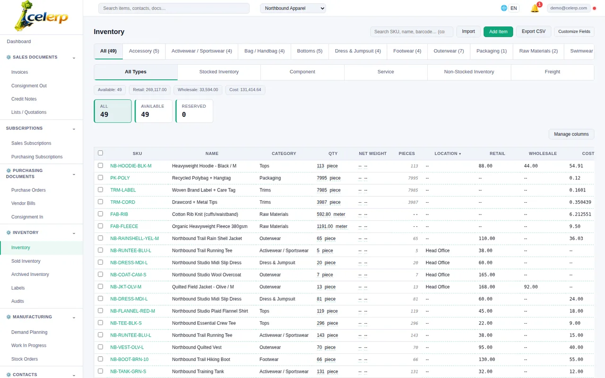

### Manufacturing cost worksheet - BOM, labor, overhead, and rolled-up unit cost

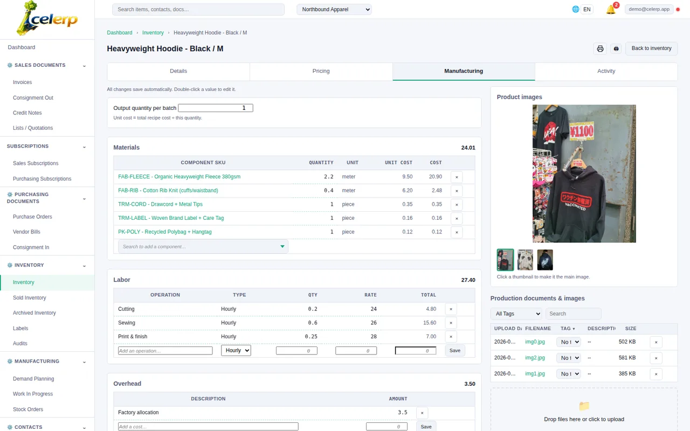

### Printable production worksheet with materials and workflow

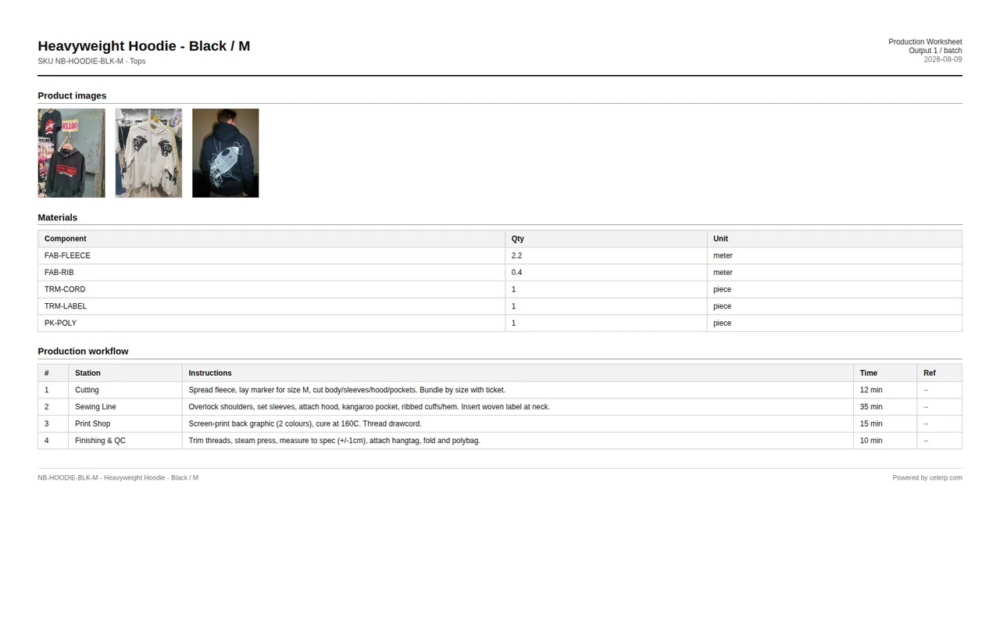

### Invoices and sales documents

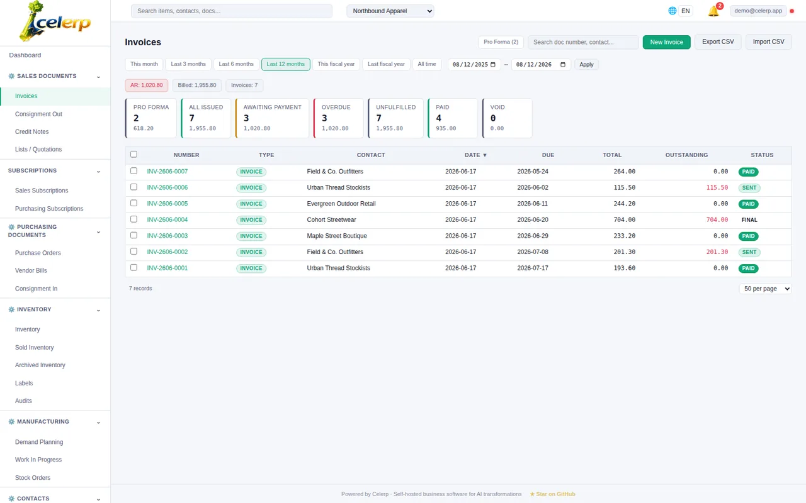

### Production planning - work orders by status, priority, and due date

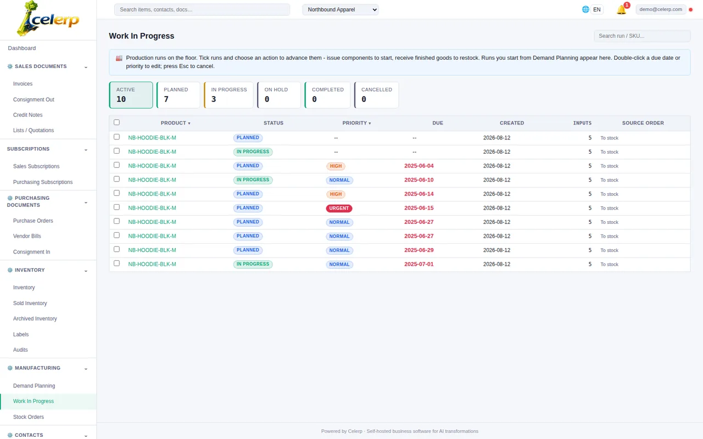

### Chart of accounts

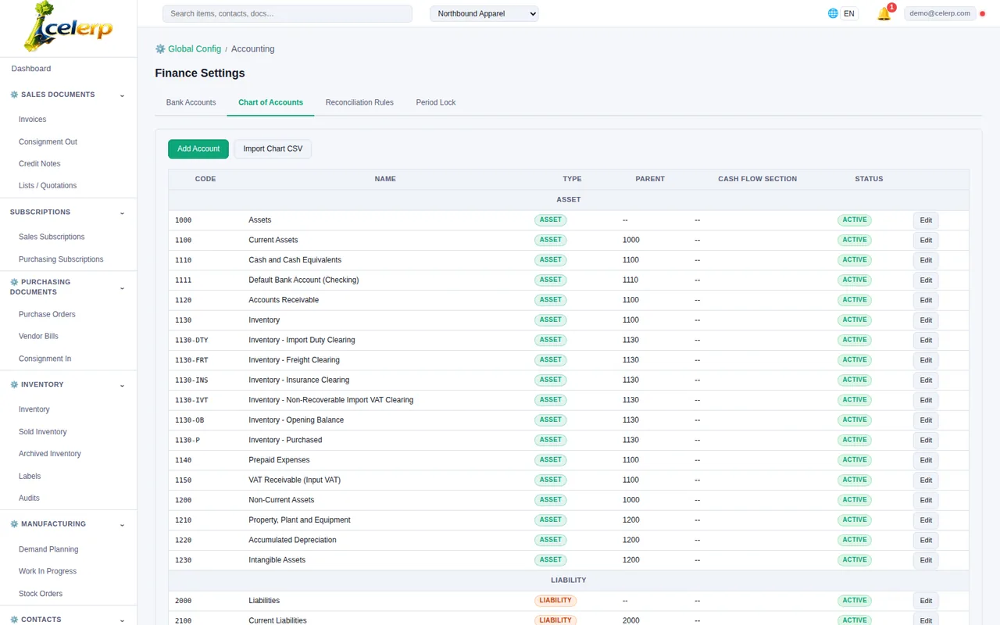

### Trial balance that ties out to zero

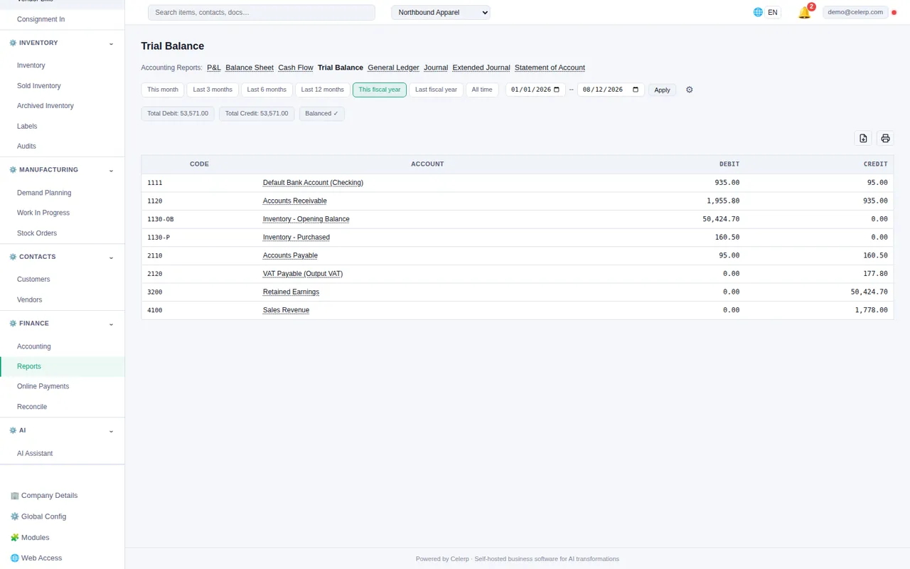

### General ledger with full account drill-down

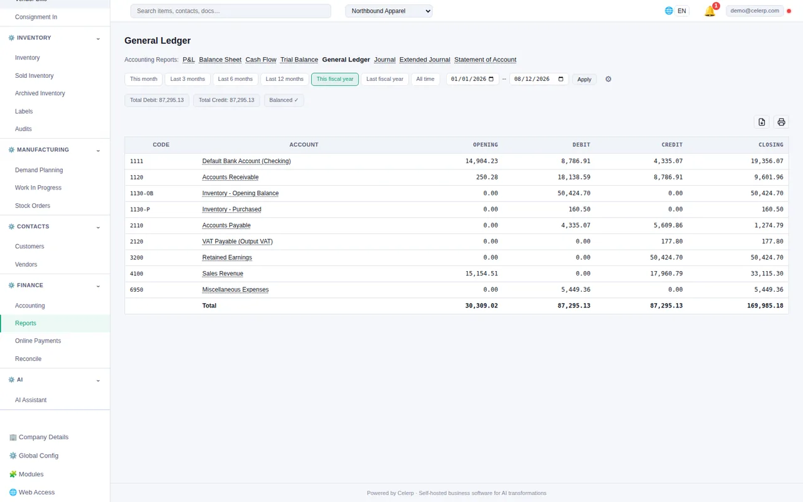

### Balance sheet generated live from the event-sourced ledger

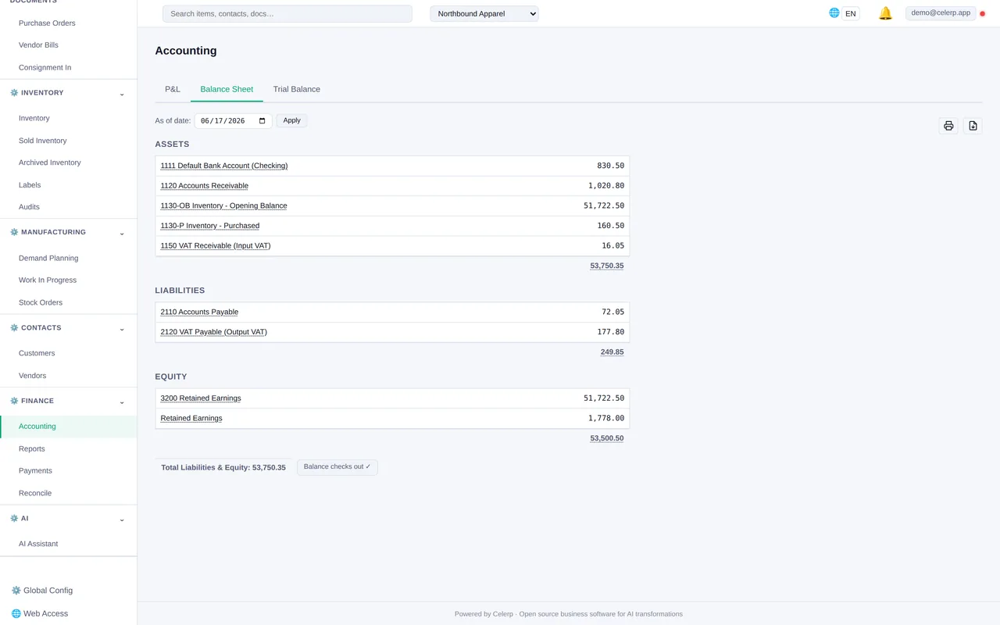

### Immutable audit log of every change

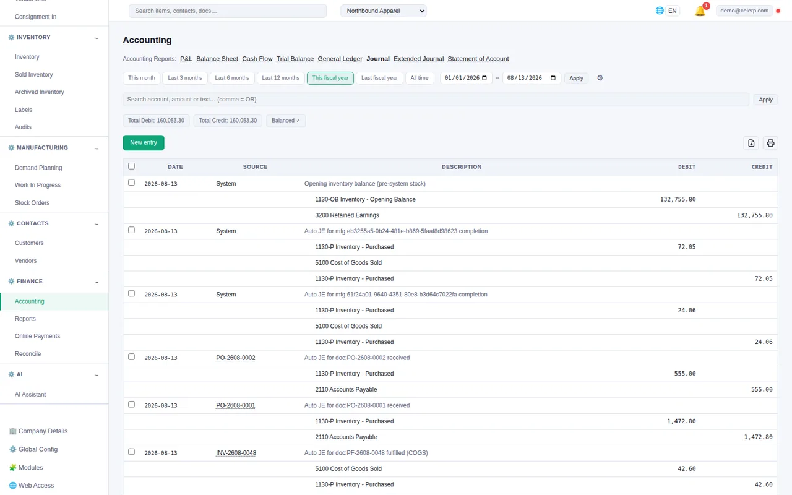

### Role-based access permissions

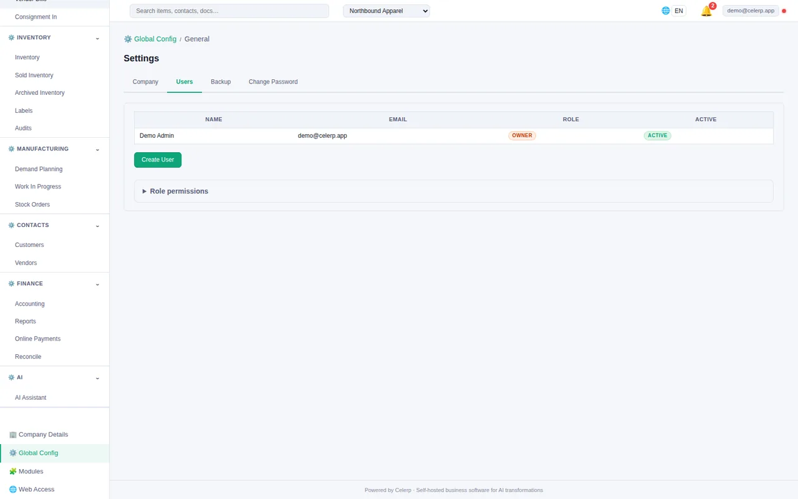

### Built-in REST API for integrations

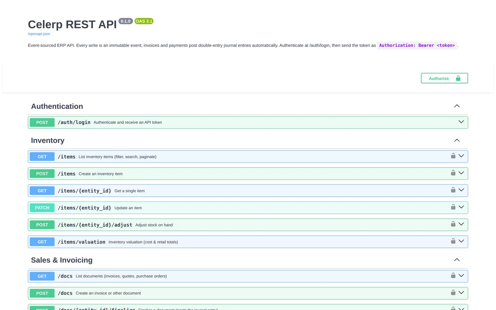

## Usage & copyright

These screenshots depict the **Celerp application UI**, which is proprietary
(see `LICENSE-PROPRIETARY.md`; the UI layer is *not* covered by the BSL core or MIT module licenses).

- Screenshots (c) 2026 Noah Severs. All rights reserved. Provided to document and promote Celerp;
  you may use them unmodified in articles, reviews, and listings about Celerp with attribution to
  Celerp. Do not alter the interface shown or imply endorsement.
- Product imagery embedded in the screenshots is CC0 / public domain (sourced via Openverse) and
  needs no attribution.
- Company and brand names shown (Lumera Skincare, Meridian Coffee Roasters, Aurelia Atelier,
  Northbound Apparel) are fictional demo data.

For use of the Celerp name and logo, see `TRADEMARK.md`.
